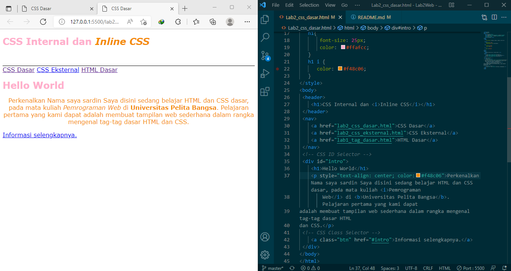

#### Nama: Sardin
#### Kelas: TI.20.A1
#### Nim: 312010135

## Pertemuan 3
Dipertemuan kali ini kita sedang belajar HTML dan CSS seperti CSS inline Internal dan Eksternal serta ID dan Class
## 1).Langkah Pertama Buat Dokumen HTML
Contoh Hasilnya

Ini adalah contoh terdapat file dokumen html dasar yang belum diberi CSS dasar internal inline eksternal.
## Code 
 <!DOCTYPE html>
    <html lang="en">

    <head>
        <meta charset="UTF-8">
        <meta http-equiv="X-UA-Compatible" content="IE=edge">
        <meta name="viewport" content="width=device-width, initial-scale=1.0">
        <title>CSS Dasar</title>
    </head>

    <body>
        <header>
            <h1>CSS internal dan <i>Inline CSS </i></h1>
        </header>
        <nav>
            <a href="lab2_css_dasar.html">CSS Dasar</a>
            <a href="lab2_css_eksternal.html">CSS Eksternal</a>
            <a href="lab1_tag_dasar.html">HTML Dasar</a>
        </nav>
        <!-- CSS ID Selector -->
        

            <h1>Hello World</h1>
            
Perkenalkan Nama saya sardin Saya disini sedang belajar HTML dan CSS dasar,pada mata kuliah <b>Pemrograman Web</b>di <i>Universitas Pelita
                    Bangsa</i>. Pelajaran pertama yang kami dapat adalah membuat tampilan web sederhana dalam rangka
                mengenal tag-tag dasar HTML dan CSS.

            <!-- CSS  Class Selector -->
            <a class="btn" href="#intro">Informasi selengkapnya.</a>
        

    </body>

    </html>   
## 2).Langkah Mendeklarasikan CSS Internal
Contoh Hasilnya

 ini adalah contoh bagaimana menaruh inline dalam CSS dan juga code code dalam css nya seperti color pada h1
## Code
    
## 3).Langkah Menambahkan Inline CSS
 contoh hasil nya serta penempatan css inline nya

ini adalah contoh CSS inline,css inline adlah prioritas dalam pendeklarasian jika di deklarasikan secara bersamaan Inline prioritas
## Code
<!-- INLINE CSS (p) -->
        
Kami sedang belajar HTML dan CSS dasar,pada mata kuliah <b>Pemrograman Web</b>di <i>Universitas Pelita
                Bangsa</i>. Pelajaran pertama yang kami dapat adalah membuat tampilan web sederhana dalam rangka
            mengenal tag-tag dasar HTML dan CSS.

## 4).Membuat CSS Eksternal
Contoh hasil dan code

css eksternal adalah css yang dimana filenya terpisah dengan html itu sendiri dengan melalui link penempatan css, css eksternal mampu digunakan banyak file html itulah keunggulan dari ccs eksternal
## Code
        nav{
            background: #ff006e ; 
            color: #fff;
            padding: 15px;
        }
        nav a {
            color: #fff;
            text-decoration: none;
            padding: 15px 20px;
        }
        nav .active,
        nav a:hover{
            background: #a4133c;
            border-radius: 4px;
        }
## 5).Menambahkan CSS Selector
Ini adalah contoh code hasilnya

css selector adalah pemilihan dengan menggunakan id atau class dan bisa juga selector pada tag dan element html id menggunakan code yang dimana didalam file css menggunakan (#) sedangkan class menggunakan code yang ketika di css pendeklarasiannya yaitu (.) sedangkan selector element atau tag pendeklarasiannya (p) atau element lainnya
## Code
        /* ID SELECTOR */
        #intro{
            background: #fed9b7;
            border: 1px solid #f94144;
            min-height: 100px;
            padding: 10px;
        }
        #intro h1{
            text-align: left;
            border: 0;
            color: #f25c54;
        }
        /* class selector */
        .btn{

            padding: 15px 20px;
            background: #edc4b3;
            color: #f20089;
            display: inline-block;
            margin: 10px;
            text-decoration: none;
        }
        .btn-primary{
            background: #f25c54;
            
        }

## Soal Latihan 
Pertanyaan dan Tugas
1. Lakukan eksperimen dengan mengubah dan menambah properti dan nilai pada kode CSS 
dengan mengacu pada CSS Cheat Sheet yang diberikan pada file terpisah dari modul ini.
2. Apa perbedaan pendeklarasian CSS elemen h1 {...} dengan #intro h1 {...}? berikan 
penjelasannya!
3. Apabila ada deklarasi CSS secara internal, lalu ditambahkan CSS eksternal dan inline CSS pada 
elemen yang sama. Deklarasi manakah yang akan ditampilkan pada browser? Berikan 
penjelasan dan contohnya!
4. Pada sebuah elemen HTML terdapat ID dan Class, apabila masing-masing selector tersebut 
terdapat deklarasi CSS, maka deklarasi manakah yang akan ditampilkan pada browser? 
Berikan penjelasan dan contohnya! `( 
 )`

## Jawaban Soal Latihan 
1)Saya akan mengubah dan menambahkan pada kode CSS.

Setelah saya jalankan
 
2)h1{} Untuk memberikan style pada semua element h1.
 #intro h1{} Awalan simbol hash (#) memungkinkan kita untuk memberi style pada id. selector id bersifat kaku dan tidak bisa digunakan kembali pada element yang lainnya.
 

3).Setelah dilakukan pengujian, deklarasi CSS Inline lebih dahulu tampil di browser, itu dikarenakan permintaan HTTP yang sangat kecil memungkinkan untuk ditampilkan dahulu. 
4).Deklarasi id="paragraf-1" akan ditampilkan pada browser, karena selektor id lebih spesifik dari class atau bahkan element P itu sendiri, kecuali jika kita menambahkan property pada inline element P maka selektor id tersebut akan tertimpa, karena inline lebih spesifik daripada id, class, dan element